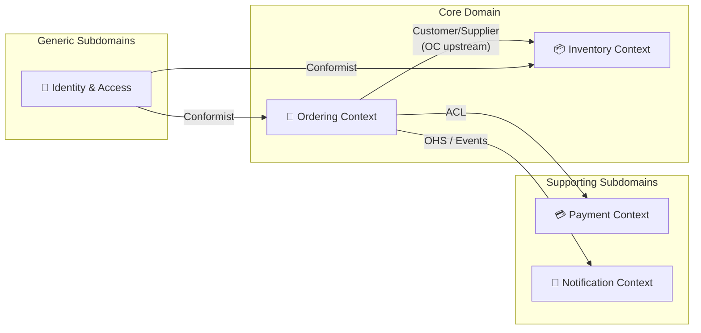
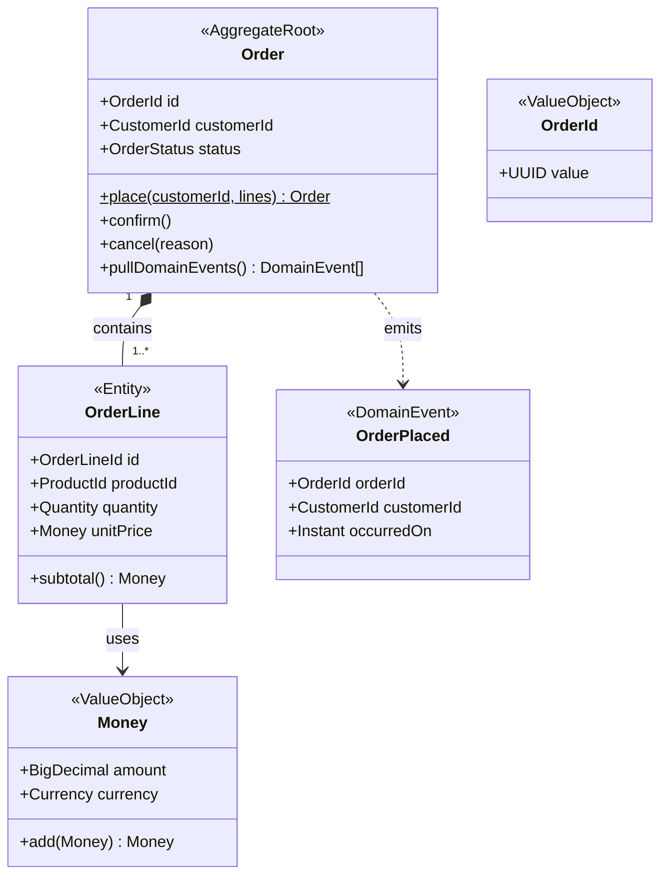
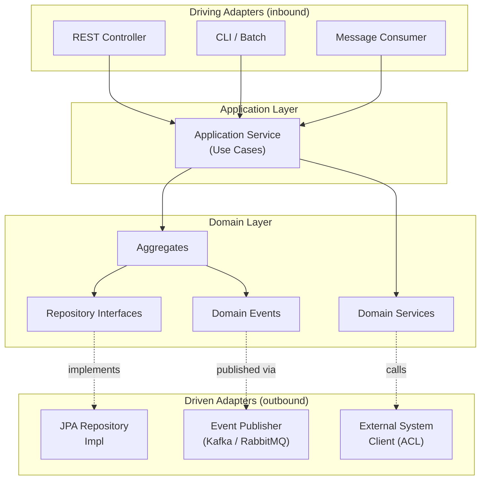
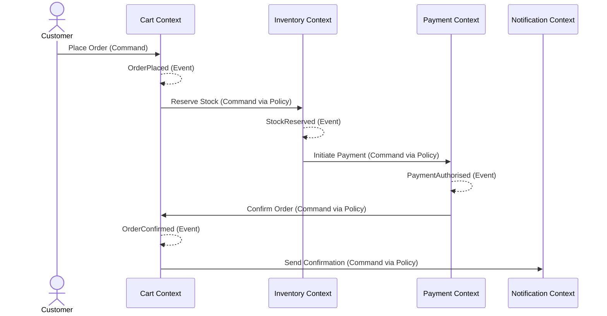

# Mermaid Diagram Templates for DDD

## Context Map

### Integration Pattern Labels to use on arrows:
- `Partnership` — teams collaborate, evolve together
- `Shared Kernel` — shared code, agreed by both teams
- `Customer/Supplier` — upstream/downstream with negotiated API
- `Conformist` — downstream conforms to upstream model as-is
- `ACL` — Anti-Corruption Layer (downstream translates upstream model)
- `OHS` — Open Host Service (upstream publishes formal API)
- `Published Language` — formal interchange format (e.g. events schema)
- `Separate Ways` — no integration, duplicate if needed

---

## Aggregate Diagram

---

## Hexagonal Architecture (per context)

---

## EventStorming Timeline (simplified)

